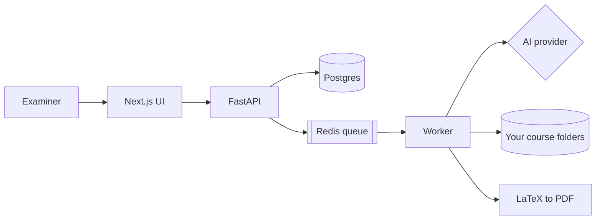

# AIEA, the AI Exam Assistant

Write exam papers from your own course material, and catch the mistakes before students do.

You point AIEA at the files you already have (lecture slides, exercise sheets, the course
book, past exams). It extracts them, generates new questions grounded in that material,
checks each one against what your course actually teaches, and assembles them into a
LaTeX exam with a matching solutions document.

The part that matters most is the checking. Generated questions tend to look right and be
subtly wrong: an answer key that solves the problem by a method you never taught, a symbol
the key uses but the question never defines, marks that do not add up, a term that appears
only in the textbook you list but never teach from. AIEA blocks an exam from compiling
until those are dealt with.

Runs entirely on your own machine. No account, no cloud service, no data leaves your
computer except the prompts you send to whichever AI provider you configure.

<p align="center">
  <em>Single user, local only. Every examiner runs their own copy.</em>
</p>

## Contents

- [What you need](#what-you-need)
- [Quick start](#quick-start)
- [Step by step from zero](#step-by-step-from-zero)
- [Setting up your first course](#setting-up-your-first-course)
- [How validation works](#how-validation-works)
- [Everyday commands](#everyday-commands)
- [When something breaks](#when-something-breaks)
- [How it is put together](#how-it-is-put-together)
- [Licence](#licence)

## What you need

| | Minimum | Notes |
|---|---|---|
| Docker Desktop (macOS, Windows) or Docker Engine + Compose (Linux) | v2 of the Compose plugin | This is the only thing you must install |
| Disk | about 6 GB | Container images, Postgres data, LaTeX toolchain |
| Memory | 8 GB, 16 GB is comfortable | The worker runs LaTeX and PDF rasterisation |
| An AI provider | one of them | An OpenAI-compatible API key, a local model server, or a CLI you are already logged into |

You do not need Python, Node, Postgres or LaTeX on your machine. All of that lives inside
the containers.

## Quick start

If you already have Docker running and just want the short version:

```bash
git clone https://github.com/am7as/aiea.git
cd aiea
cp .env.example infra/.env   # then edit AIEA_HOST_HOME to your own home path
docker compose -f infra/docker-compose.yml up -d --build
docker compose -f infra/docker-compose.yml exec api pixi run migrate
```

Open <http://localhost:4022>.

The first build pulls and compiles a lot, so expect 5 to 15 minutes. Later starts take
about 20 seconds.

## Step by step from zero

This section assumes nothing is installed.

### 1. Install Docker

<details>
<summary><b>macOS</b></summary>

Download Docker Desktop from <https://www.docker.com/products/docker-desktop/> and pick the
build matching your chip (Apple silicon or Intel). Open the `.dmg`, drag Docker to
Applications, launch it, and wait for the whale icon in the menu bar to stop animating.

Or with Homebrew:

```bash
brew install --cask docker
open -a Docker
```

Check it works:

```bash
docker --version
docker compose version
```
</details>

<details>
<summary><b>Windows</b></summary>

Docker Desktop on Windows runs through WSL 2, so install that first. In PowerShell **as
Administrator**:

```powershell
wsl --install
```

Restart when it asks. Then download Docker Desktop from
<https://www.docker.com/products/docker-desktop/> and run the installer, leaving
"Use WSL 2 instead of Hyper-V" ticked.

Run every command in this README from **Git Bash**, **PowerShell** or a **WSL terminal**.
The commands below are shown in a form that works in Git Bash and WSL. If you use
PowerShell, replace `cp` with `Copy-Item`.

Check it works:

```powershell
docker --version
docker compose version
```
</details>

<details>
<summary><b>Linux</b></summary>

On Ubuntu or Debian:

```bash
curl -fsSL https://get.docker.com | sudo sh
sudo usermod -aG docker $USER
newgrp docker
```

On Fedora:

```bash
sudo dnf install docker docker-compose-plugin
sudo systemctl enable --now docker
sudo usermod -aG docker $USER
newgrp docker
```

Check it works:

```bash
docker --version
docker compose version
```

If `docker compose version` fails but `docker-compose --version` works, you have the old
standalone tool. Install the Compose v2 plugin, or substitute `docker-compose` for
`docker compose` throughout.
</details>

### 2. Get the code

```bash
git clone https://github.com/am7as/aiea.git
cd aiea
```

No Git yet? Install it with `brew install git` (macOS), `sudo apt install git` (Debian or
Ubuntu), or from <https://git-scm.com/download/win> (Windows). Or download the ZIP from the
green **Code** button on GitHub and unpack it.

To update later:

```bash
git pull
docker compose -f infra/docker-compose.yml up -d --build
docker compose -f infra/docker-compose.yml exec api pixi run migrate
```

### 3. Configure

```bash
cp .env.example infra/.env
```

The file has to sit next to the Compose file, in `infra/`. Docker Compose looks for it
there, not in the repository root.

Open `infra/.env` and set `AIEA_HOST_HOME` to your own home directory. This is the one value you
must change; the containers mount folders from it so AIEA can read your course files.

| Your system | Example value |
|---|---|
| macOS | `/Users/jane` |
| Linux | `/home/jane` |
| Windows | `/c/Users/jane` |

Windows note: use forward slashes and the `/c/` prefix, not `C:\Users\jane`. Docker
translates that form correctly.

Then set `AIEA_ALLOWED_ROOTS` to the folders you will keep course material in. Keep it
narrow. Pointing it at your entire home directory is known to crash Docker Desktop's file
sharing on macOS.

### 4. Start it

```bash
docker compose -f infra/docker-compose.yml up -d --build
```

Watch the progress if you want:

```bash
docker compose -f infra/docker-compose.yml logs -f
```

Press `Ctrl+C` to stop watching. That does not stop the containers.

### 5. Create the database tables

Once only, on a fresh install:

```bash
docker compose -f infra/docker-compose.yml exec api pixi run migrate
```

### 6. Check everything is up

```bash
docker compose -f infra/docker-compose.yml ps
```

You should see six services running: `api`, `worker`, `frontend`, `caddy`, `postgres`,
`redis`.

Now open <http://localhost:4022>.

| URL | What it is |
|---|---|
| <http://localhost:4022> | The app. Use this one. |
| <http://localhost:4021/docs> | API reference, if you want to script against it |

### 7. Connect an AI provider

Nothing generates until you do this. In the app, go to **AI → Providers**, add a provider,
then go to **AI → Task Routing** and point at least the `default` task at it.

| Provider type | Good for |
|---|---|
| `token` | Any OpenAI-compatible API. Paste a base URL and key. |
| `lmstudio` or `ollama` | A model running on your own machine. Nothing leaves it. |
| `subscription` | A Claude or Gemini CLI you are already signed into on the host |

`subscription` providers need a small helper on the host, because containers cannot run
programs installed on your machine. Start it with `./scripts/shim-ctl.sh start`. The
Providers page shows whether it is reachable.

Two tasks need a model that can read images: `material-extraction` and
`answer-validation`. Route those to a vision-capable provider. Text-only models fail
silently on them, which is worse than failing loudly.

## Setting up your first course

1. **Workspace**: Create a course and give it four folders: `materials`, `brain`,
   `library`, `workshop`. AIEA can scaffold them for you.
2. Put your files in `materials`, sorted into `lectures/`, `exercises/`, `exams/`,
   `book/`. This matters more than it looks: AIEA decides what your course *teaches*
   from where a file sits, so a solutions manual filed under `lectures/` will be treated
   as taught material.
3. **Extraction**: Scan and extract. Slides, PDFs and Word documents all work.
4. **Course Map**: Build the syllabus. This gives chapters and learning outcomes to
   generate against.
5. **Question Generation**: Generate questions per chapter and category.
6. **Question Bank**: Produce answer keys and run Evaluate.
7. **Exam Builder**: Assemble a paper, or several variants at once.
8. **Validation**: Check it. Fix what it finds.
9. **Exam Bank**: Compile to PDF.

## How validation works

Two layers, because they fail in different ways.

**Deterministic checks** run in under a second with no AI call. Marks that do not add up,
an answer key that answers a part the question never asked, a symbol used in the key but
never defined, broken LaTeX, missing figures, and terminology that appears nowhere in your
taught material. These are reproducible: the same exam always gives the same answer.

**AI reviewers** run when you ask for a deep review. A blind solver answers each question
from the question and its figures alone and compares against your key. An examiner judges
difficulty, timing and mark allocation. A syllabus auditor rules on borderline terminology
that counting alone cannot settle.

Findings are `blocking`, `warning` or `note`. **An exam with unresolved blocking findings
will not compile.** You can override that, but the reason is recorded on the exam, because
an override with no reason is indistinguishable from nobody having looked.

### Teaching it your vocabulary

Two files in your course's `brain/validation/` folder:

- `deny-terms.md` holds terms ruled out for this course. One per line. These block.
- `allow-terms.md` holds terms you have accepted. These are never reported again.

This is deliberately per course. Counting alone cannot tell imported jargon from ordinary
wording built out of words your course does use, so the tool warns and you make the call
once.

## Everyday commands

Run these from the repository root.

```bash
# Start / stop
docker compose -f infra/docker-compose.yml up -d
docker compose -f infra/docker-compose.yml down

# Follow the logs
docker compose -f infra/docker-compose.yml logs -f worker

# Apply new migrations after a git pull
docker compose -f infra/docker-compose.yml exec api pixi run migrate

# Run the tests
docker compose -f infra/docker-compose.yml exec api pixi run test

# Wipe everything, including the database
docker compose -f infra/docker-compose.yml down -v
```

If you install [Pixi](https://pixi.sh) on the host you get shorter versions: `pixi run up`,
`pixi run down`, `pixi run logs`, `pixi run reset`. It is optional.

## When something breaks

**`required variable AIEA_HOST_HOME is missing a value`.** You skipped step 3, or put the
file in the wrong place. It belongs at `infra/.env`, not the repository root.

**Ports already in use.** AIEA uses 4020 to 4026. Find the culprit with `lsof -i :4022`
(macOS, Linux) or `netstat -ano | findstr :4022` (Windows), or change the ports in
`infra/docker-compose.yml`.

**The app loads but nothing generates.** No AI provider is routed. Check **AI → Providers**
and **AI → Task Routing**.

**Generation times out.** Long generation jobs are usually a prompt that is too large.
AIEA narrows the material automatically, but a very large single document can still be
slow. Generate one chapter at a time.

**Panels never finish loading.** Usually Docker running out of memory, especially with
other stacks running. Raise the memory limit in Docker Desktop settings.

**A page shows an error after `git pull`.** You probably have a pending migration:
`docker compose -f infra/docker-compose.yml exec api pixi run migrate`.

**Containers cannot see your files.** `AIEA_HOST_HOME` in `infra/.env` does not match your real
home directory, or the folder is not listed in `AIEA_ALLOWED_ROOTS`. On Windows check you
used `/c/Users/...` and not `C:\Users\...`.

More in [`docs/troubleshooting.md`](docs/troubleshooting.md).

## How it is put together



The API stays responsive by never doing slow work itself. Extraction, generation,
validation and PDF compilation all run in the worker.

| | |
|---|---|
| Backend | Python 3.12, FastAPI, SQLAlchemy 2.x async, Alembic, ARQ |
| Frontend | Next.js 15, React 19, Tailwind v4 |
| Data | Postgres, Redis |
| Documents | CircuiTikZ for circuits, matplotlib for plots, Tectonic for PDF |
| Packaging | Docker Compose, Pixi inside each container |

Longer notes live in [`docs/`](docs/): [architecture](docs/architecture.md),
[AI engine](docs/ai-engine.md), [extraction](docs/extraction.md), [ports](docs/ports.md).

## Licence

MIT. See [LICENSE](LICENSE). Use it, change it, teach with it.
