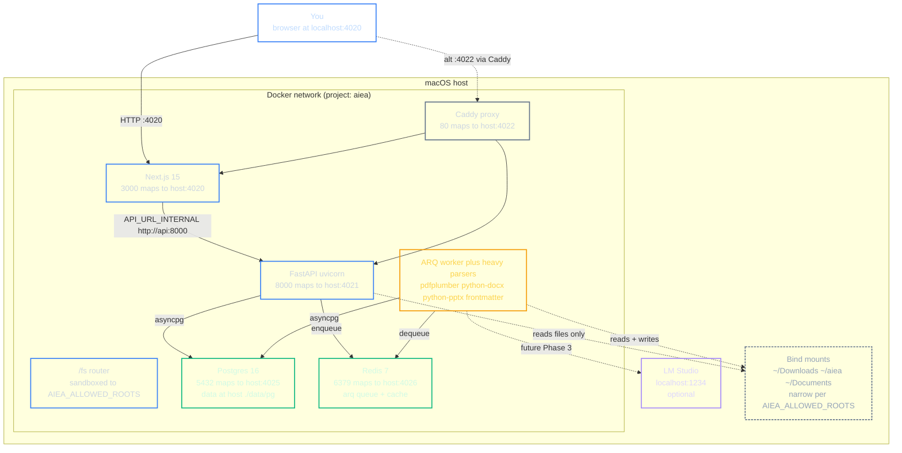

# 01 — System architecture

How AIEA's services fit together on the host (your Mac) and inside Docker.

## Key invariants

- **The api container does NOT have pdfplumber / python-docx / python-pptx.** Those live only in the worker's pixi env. Any module under `backend/app/extract/` must be loaded via `importlib.import_module()` from `app/extract/registry.py` — never imported at module load time from anywhere the api loads. See `docs/decisions/001-worker-vs-api-deps.md`.
- **Bind mounts are narrow.** `AIEA_ALLOWED_ROOTS` lists which host folders are reachable; the docker-compose volumes block mounts the same set. Never bind-mount `$HOME` whole on macOS — see `docs/troubleshooting.md` entry #10.
- **Postgres data lives on the host filesystem** (`./data/pg/`), not in a named Docker volume. `docker compose down -v` and even Docker Desktop's "Clean / Purge data" preserve it. Wipe with `rm -rf data/pg/` only when you really mean it.
- **No auth.** Single-user, localhost. CORS regex permits `localhost / 127.0.0.1 / host.docker.internal / LAN-IP` origins. Don't run AIEA on a public host without adding auth in front.
