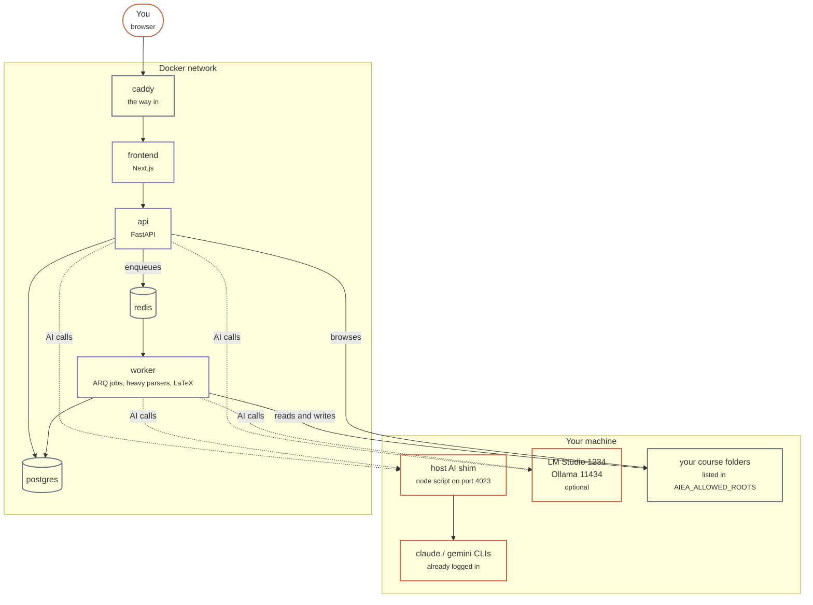

# 01 — System architecture

How AIEA's parts fit together: what runs on your machine, what runs in Docker, and how they
reach each other.

Clay is you and your machine. Violet is AIEA. Slate is infrastructure. Dashed lines are AI
calls, which are the only traffic that can leave your computer.

## Ports

Every published port is bound to `127.0.0.1`, so nothing is reachable from your network.

| Port | Service | Use it? |
|---|---|---|
| **4022** | caddy | **Yes. This is the app.** |
| 4020 | frontend | Direct, for debugging |
| 4021 | api | Direct, for curl and the API docs |
| 4023 | host AI shim | Runs on your machine, not in Docker |
| 4025 / 4026 | postgres / redis | Debugging only |

## Why the shim exists

Subscription providers drive the `claude` and `gemini` CLIs that you have already logged
into. Those are programs on your machine, and a container cannot run them. The shim is a
small Node script that exposes them over HTTP so the containers can reach them.

Start it with `pixi run shim start`, or it starts with `pixi run up`. Without it,
subscription providers do not work at all. The Providers page shows whether it is running.

## Key invariants

- **The api container does not have the heavy parsers.** `pdfplumber`, `python-docx` and
  `python-pptx` live only in the worker's environment. Anything under `backend/app/extract/`
  is loaded through `importlib` from a registry, never imported at module load time by the
  api. See [decisions/001](../decisions/001-worker-vs-api-deps.md).
- **Bind mounts are narrow.** `AIEA_ALLOWED_ROOTS` lists which of your folders the
  containers can see, and the Compose mounts match it. Never mount your whole home
  directory. See [troubleshooting](../troubleshooting.md) entry 10.
- **Postgres and Redis persist to `./data/`** on your disk, not to a named Docker volume.
  `docker compose down -v` will not remove them; `rm -rf data/pg` will.
- **No auth.** Single user, localhost only. Do not expose AIEA on a public host without
  putting authentication in front of it.
