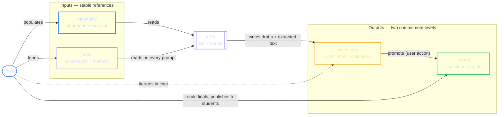
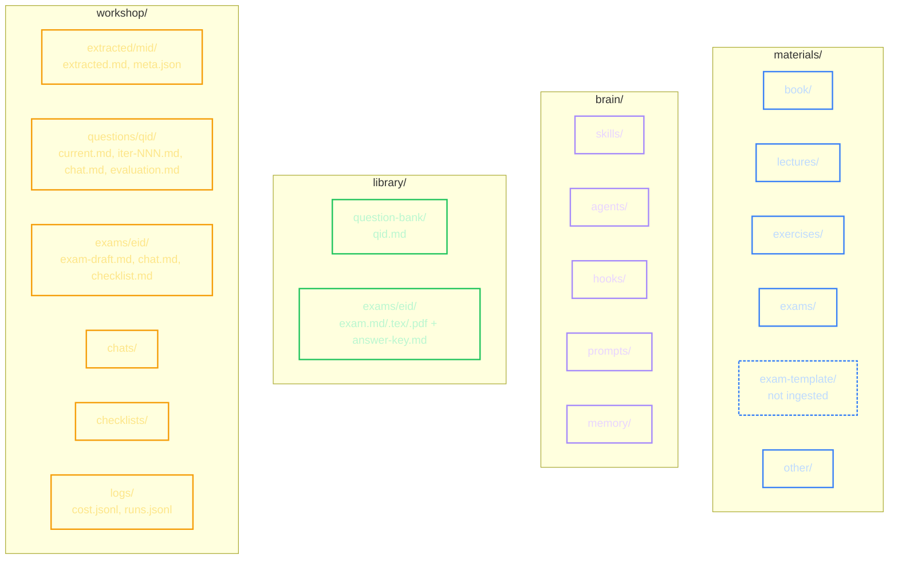

# 02 — Four-folder model

Every course owns four absolute host paths. They're chosen by the user (anywhere AIEA can reach via `AIEA_ALLOWED_ROOTS`) and divided into two inputs + two outputs:

## Canonical subfolder layout

## Asymmetry to remember

|  | materials | brain | library | workshop |
|---|---|---|---|---|
| Who writes | you | you | AIEA on promote | AIEA + you |
| Who reads | AIEA | AIEA every prompt | you (publish to students) | you (iterate) |
| Regenerable? | no | no | yes — from materials + brain | yes |
| Backup priority | medium | **high (smallest, most valuable)** | low | low |
| Version-control? | optional | **yes** | no | no |

The library is the curated face of your work; the workshop is the messy process. Promotion (workshop → library) is an explicit user action with quality gates.
