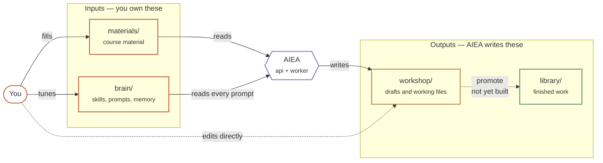
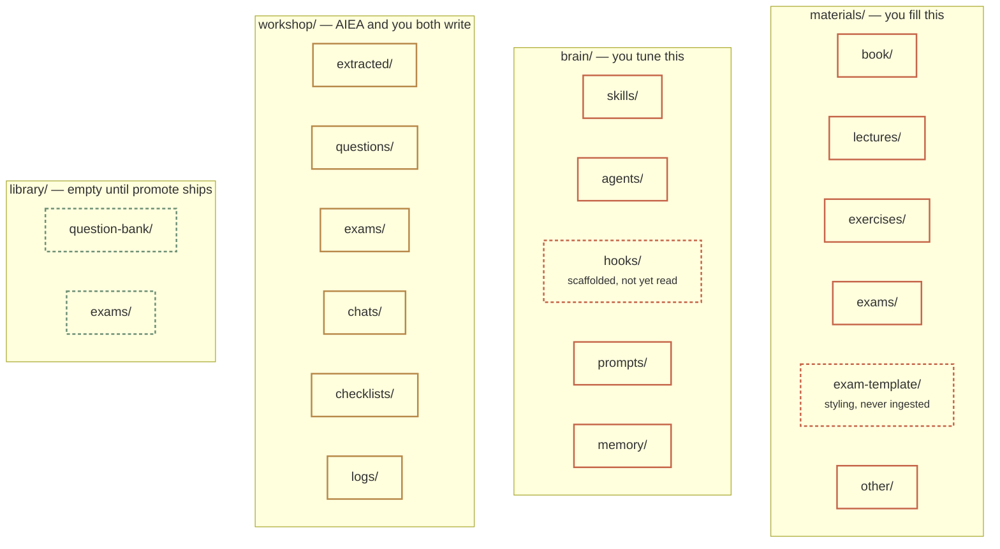
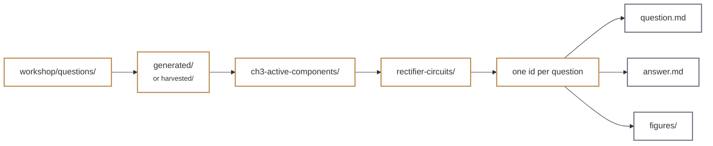

# 02 — Four-folder model

Every course owns four absolute host paths. You choose them, anywhere AIEA can reach through
`AIEA_ALLOWED_ROOTS`. Two are inputs you own, two are outputs AIEA writes.

**Reading the colours.** Warm clay is yours to write. Violet is AIEA. Ochre is a draft.
Green is finished. The same four colours mean the same four things in every diagram here.

## What is actually inside each folder

`materials/` and `brain/` are scaffolded with README files when you create a course.
`workshop/` and `library/` are filled as you work.

A dashed border means scaffolded but not yet used by any code path.

## How a question is stored

Each question is a folder, not a file. The path carries its own metadata, so the vault stays
browsable in Obsidian or a file manager without a database.

An exam is the same idea: `workshop/exams/generated/` then one folder per exam, holding
`exam.tex`, `exam.pdf`, `_questions.tex`, `instructions.tex`, plus `figures/` and `questions/`.

## Asymmetry to remember

|  | materials | brain | workshop | library |
|---|---|---|---|---|
| Who writes | you | you | AIEA and you | nothing yet |
| Who reads | AIEA | AIEA, every prompt | you | you, once promote ships |
| Can it be regenerated? | no | no | yes | yes |
| Back it up? | medium priority | **highest — smallest and least replaceable** | low | low |
| Put it in git? | optional | **yes** | no | no |

`brain/` is the folder to protect. It is a few kilobytes of text that encodes how you want
AIEA to behave, and nothing else can reproduce it.
