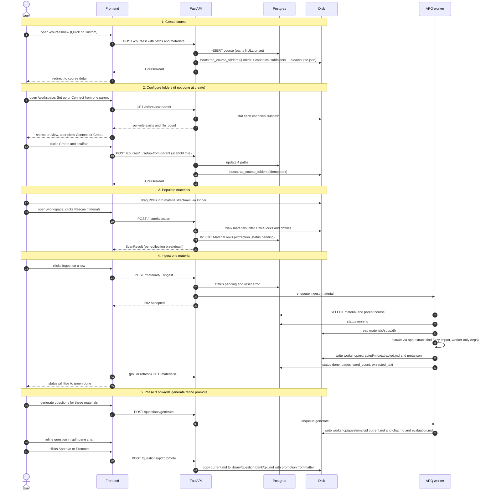

# 03 — Course lifecycle

From "I want to use AIEA for this course" to "I have a promoted question I trust".

## What's shipped today vs. what's future

- ✅ Steps 1–4 are live (Phases 0 / 1 / 2 / 2.5 / 2.6).
- ⏳ Step 5 is Phase 3 onwards: AI gateway, generation, evaluation, review chain, promotion plumbing.
