# 04 — Ingestion flow

What happens between "you drop a PDF in `materials/lectures/`" and "AIEA has it indexed as a `Material` with extracted text on disk".

```mermaid
flowchart TB
    drop["User drops file via Finder"]:::user
    drop --> rescan["User clicks Rescan materials"]:::user
    rescan -- "POST /materials/scan" --> scan["api: scan_course_materials"]:::api

    scan --> scanWalk["app.vault.scanner.scan_materials walks materials and filters Office locks, dotfiles, README.md, unknown extensions"]:::filter

    scanWalk --> compare["compare to existing Material rows (by course_id + subpath)"]:::api
    compare --> insert["INSERT new rows extraction_status=pending"]:::db

    insert --> uiAfterScan["UI shows new files with pending pill + Ingest button"]:::ui

    uiAfterScan --> ingestBtn["User clicks Ingest"]:::user
    ingestBtn -- "POST /materials/id/ingest" --> api2["api: trigger_ingest"]:::api
    api2 --> enq["queue.enqueue ingest_material material_id"]:::queue
    api2 --> uiPending["UI: status running after poll/refresh"]:::ui

    enq --> worker["arq worker: app.workflows.ingest.ingest_material"]:::worker
    worker --> loadMat["SELECT Material and parent Course"]:::db
    loadMat --> setRunning["UPDATE status running"]:::db
    setRunning --> resolveKind["determine extractor via app.vault.scanner.extractor_kind_for filename"]:::worker

    resolveKind --> lazyImport["app.extract.registry.get_extractor uses importlib.import_module — worker-only deps loaded here pdfplumber python-docx python-pptx frontmatter"]:::worker

    lazyImport --> extract["extractor.extract host_path via asyncio.to_thread returns ExtractedDoc"]:::worker

    extract --> writeFiles["app.vault.writer writes workshop/extracted/mid/extracted.md and meta.json"]:::fs

    writeFiles --> updateDB["UPDATE Material pages, extracted_text, extraction_method, status done"]:::db

    updateDB --> uiDone["UI after poll or refresh: green done pill"]:::ui

    classDef user fill:transparent,stroke:#3b82f6,color:#bfdbfe,stroke-width:2px
    classDef api fill:transparent,stroke:#3b82f6,color:#cbd5e1,stroke-width:2px
    classDef worker fill:transparent,stroke:#f59e0b,color:#fcd34d,stroke-width:2px
    classDef filter fill:transparent,stroke:#64748b,color:#cbd5e1,stroke-width:2px
    classDef db fill:transparent,stroke:#10b981,color:#d1fae5,stroke-width:2px
    classDef queue fill:transparent,stroke:#a78bfa,color:#ddd6fe,stroke-width:2px
    classDef fs fill:transparent,stroke:#64748b,color:#94a3b8,stroke-width:2px,stroke-dasharray:4 2
    classDef ui fill:transparent,stroke:#3b82f6,color:#cbd5e1,stroke-width:2px
```

## Critical separation: scan vs. ingest

- **Scan** runs in the api container (cheap, no worker-only deps needed). It just lists files and writes DB rows. New files start in `pending`.
- **Ingest** runs in the worker container, where the heavy parsers exist. It's the only place `pdfplumber`, `python-docx`, etc. get imported — and only via `importlib.import_module()` from the registry, never at module load.

## Why the separation matters

If the api container imported `pdfplumber` at module-load time, uvicorn would crash with `ModuleNotFoundError` (because the api's pixi env doesn't ship those libs). That bug class hit AASAP on first bring-up; AIEA is pre-fixed via the lazy registry. See `docs/decisions/001-worker-vs-api-deps.md`.

## What you'd add to support a new file type (e.g. `.epub`)

1. Add the parser dep to `backend/pixi.toml` under `[feature.worker.pypi-dependencies]` (worker env only).
2. Create `backend/app/extract/epub.py` exposing an `EpubExtractor(AbstractExtractor)` that returns an `ExtractedDoc`.
3. Register it in `app/extract/registry.py::_REGISTRY` (one line).
4. Add the extension to `app/vault/scanner.py::SUPPORTED_EXTENSIONS` + `_EXTRACTOR_BY_SUFFIX`.

No other code changes. The api stays oblivious.
