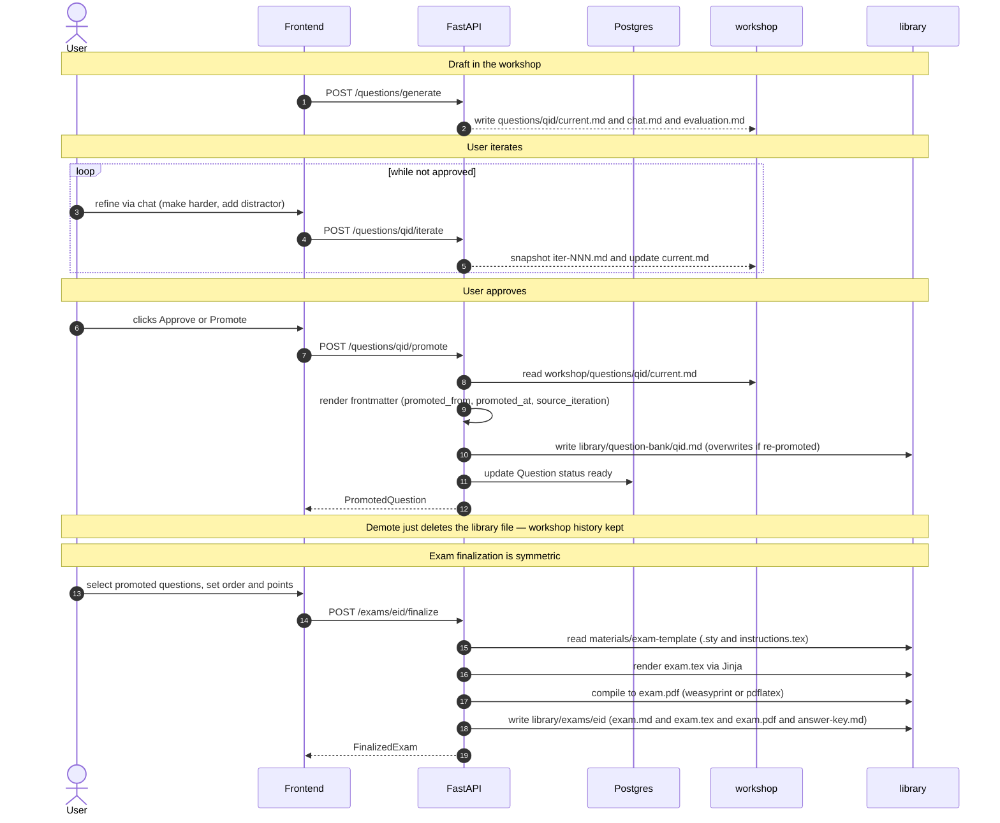

# 05 — Promotion flow (workshop → library)

> **Status:** the data model and folder layout are in place. The promote *action* lands in Phase 6/7 (review chain + exam builder). This diagram documents the intended flow so the future implementation has a fixed target.



## Why promotion is an explicit user action

Without an explicit gate, the library would fill with every AI-generated artifact and lose its meaning. The library only earns its keep if:

- **Promotion is frictionless** — one button, one keystroke. Otherwise users won't curate.
- **Promotion is reversible** — demote just deletes the library file; workshop history (iterations + chat) is preserved indefinitely.
- **Promotion is gated by hooks** — `<brain>/hooks/before-promote.md` can enforce quality rules ("every question must have est_minutes set"); `after-promote.md` can log/notify.

## Frontmatter convention

Every promoted file carries:

```yaml
---
promoted_from: workshop/questions/<qid>/current.md
promoted_at: 2026-05-14T11:42:00+00:00
source_iteration: 5
course_id: <uuid>
course_code: SSY300
question_id: <uuid>
---
```

So the library is self-describing — open `library/question-bank/<qid>.md` in Obsidian and you immediately know what produced it.
