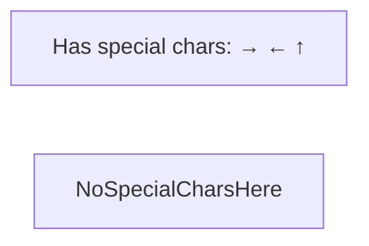

# Authoring Mermaid diagrams in AIEA docs

A few rules learned the hard way. Follow them and you'll avoid 90% of parse errors.

## How AIEA renders diagrams

- The in-app docs viewer (`/docs`) parses Markdown with `react-markdown` + `remark-gfm`.
- Fenced code blocks tagged ` ```mermaid ` are extracted from the HAST node's raw text (not from the React-encoded children) and passed to `mermaid.render()` client-side.
- Theme: `base` (not `dark`) with custom `themeVariables` providing **transparent fills + colored borders**. The diagram's container card supplies the dark background.

## Source-content rules

### 1. Don't put these reserved words as the FIRST WORD of a sequenceDiagram message body

Mermaid's lexer is shared across diagram types. Words like `click`, `end`, `call`, `link`, `class`, `style` can be mis-parsed as the start of a new statement even inside a `User->>UI: ...` message.

- ❌ `User->>UI: click Approve`
- ✅ `User->>UI: clicks Approve`
- ✅ `User->>UI: taps Approve`
- ✅ `User->>UI: press [Approve]` *(but see #2)*

### 2. Avoid these characters in sequenceDiagram message text

- `[ ]` — Mermaid may interpret as bracket labels / activations
- `< >` — looks like fragments of arrow tokens
- `&` — sometimes confuses the lexer
- `( )` — usually safe in messages but can break in node labels
- `;` — **Mermaid treats semicolon as a statement separator** (like JS). `Note over A,B: did X; then Y` is silently split into TWO statements, the second of which is gibberish. Use `,`, `—`, or `.` instead.

In **flowcharts** with quoted node labels (`A["text"]`), `< > & ( )` are all fine. The lexer treats the quoted string as opaque. **Mostly.** `<br/>` is supported for line breaks inside `[" ... "]`. **Quoted node labels still split on `;` outside the quotes,** but `;` *inside* quotes is fine.

### 3. Inside `mermaid` fences, write `<` and `>` literally — never `&lt;`/`&gt;`

The renderer extracts the raw HAST text-node value, so HTML entities are passed verbatim to Mermaid (which doesn't decode them).

- ❌ `walks materials/&lt;collection&gt;/*`
- ✅ `walks materials/collection/*`

### 4. Prefer plain words over placeholders inside diagrams

Diagrams are conceptual. `materials/lectures/` reads better than `<materials>/lectures/` and avoids the special-character minefield. Save concrete placeholder syntax for the prose around the diagram.

### 5. Always quote node labels with special chars in flowcharts



## Style rules

### Border-only classDefs, and never set a text colour

Transparent fill plus a coloured border. Do not set `color:`. These diagrams render on the
app's dark page **and** on GitHub, where the reader may be on the light theme; a fixed text
colour cannot be legible on both. Leaving `color:` unset lets Mermaid use the host theme's
own text colour, which is correct in both places.

The earlier house style set pale text colours such as `#bfdbfe`. Measured against a white
GitHub background those scored around 1.2 to 1.5 against a required 4.5, so the labels were
effectively invisible to anyone not using dark mode.

```text
classDef input  fill:transparent,stroke:#C6664A,stroke-width:2px
classDef engine fill:transparent,stroke:#8B7BB8,stroke-width:2px
classDef draft  fill:transparent,stroke:#B8894A,stroke-width:2px
```

That block is fenced as `text`, not `mermaid`. A bare `classDef` is a statement, not a
diagram, so tagging it `mermaid` makes it fail to parse and renders a red error box.

### Colour palette

Four colours, one meaning each, used the same way in every diagram. Meaning lives in the
border; the text stays theme-coloured.

| Role | stroke | Meaning |
|---|---|---|
| you and your files | `#C6664A` clay | Anything you own and write |
| AIEA | `#8B7BB8` violet | The engine: api, worker, AI gateway |
| draft output | `#B8894A` ochre | Written by AIEA, still working material |
| finished output | `#6E9075` sage | Promoted, publishable |
| infrastructure | `#6B7280` slate | Containers, disks, ports, mounts |

All strokes use `stroke-width:2px`. Use `stroke-dasharray:4 3` for something scaffolded or
planned but not yet wired up, and say so in a caption. Every diagram that uses colour should
carry one line under it explaining what the colours mean.

### `theme: "base"`, not `"dark"`

Mermaid v11's `dark` theme lightens user-specified fills. We use `theme: "base"` so our `classDef fill:transparent` actually renders as transparent.

## React StrictMode + Mermaid is a foot-gun (heads-up for component authors)

If you ever wrap or re-implement `<Mermaid>`:

1. **Use a random id per `useEffect` invocation**, not a stable `useId()` value. StrictMode in dev double-mounts components, and the second mount's cleanup will race the first mount's in-flight `mermaid.render()` if they share an id — Mermaid then derefs `null.firstChild` inside its own code.
2. **Only remove Mermaid's temp orphan in `finally`** after `await render()` returns. Pre-cleanup or unmount-cleanup destroys the working element mid-flight.

See `frontend/src/components/Mermaid.tsx` and `docs/troubleshooting.md` entry #11.5.

## Why we don't render Mermaid server-side

The renderer is client-side because mermaid is ~600 KB. Server-side rendering would require Puppeteer or similar. Client-side keeps the bundle small for non-docs pages and lazy-loads mermaid only when a Mermaid block is rendered.

## If a diagram won't render

1. Open the file in a Markdown previewer that supports Mermaid (Obsidian works) and read its parse error directly.
2. Look at the parse error's "expecting" list — that names the tokens the lexer wanted next.
3. Check this doc's rules 1–5 above.
4. Reduce the diagram to a minimum failing case (delete half, see if it parses; bisect).
