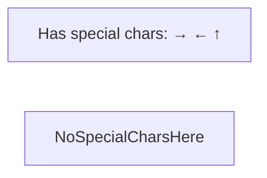

# Authoring Mermaid diagrams in AIEA docs

A few rules learned the hard way. Follow them and you'll avoid 90% of parse errors.

## How AIEA renders diagrams

- The in-app docs viewer (`/docs`) parses Markdown with `react-markdown` + `remark-gfm`.
- Fenced code blocks tagged ` ```mermaid ` are extracted from the HAST node's raw text (not from the React-encoded children) and passed to `mermaid.render()` client-side.
- Theme: `base` (not `dark`) with custom `themeVariables` providing **transparent fills + colored borders**. The diagram's container card supplies the dark background.

## Source-content rules

### 1. Don't put these reserved words as the FIRST WORD of a sequenceDiagram message body

Mermaid's lexer is shared across diagram types. Words like `click`, `end`, `call`, `link`, `class`, `style` can be mis-parsed as the start of a new statement even inside a `User->>UI: ...` message.

- ❌ `User->>UI: click Approve`
- ✅ `User->>UI: clicks Approve`
- ✅ `User->>UI: taps Approve`
- ✅ `User->>UI: press [Approve]` *(but see #2)*

### 2. Avoid these characters in sequenceDiagram message text

- `[ ]` — Mermaid may interpret as bracket labels / activations
- `< >` — looks like fragments of arrow tokens
- `&` — sometimes confuses the lexer
- `( )` — usually safe in messages but can break in node labels
- `;` — **Mermaid treats semicolon as a statement separator** (like JS). `Note over A,B: did X; then Y` is silently split into TWO statements, the second of which is gibberish. Use `,`, `—`, or `.` instead.

In **flowcharts** with quoted node labels (`A["text"]`), `< > & ( )` are all fine. The lexer treats the quoted string as opaque. **Mostly.** `<br/>` is supported for line breaks inside `[" ... "]`. **Quoted node labels still split on `;` outside the quotes,** but `;` *inside* quotes is fine.

### 3. Inside `mermaid` fences, write `<` and `>` literally — never `&lt;`/`&gt;`

The renderer extracts the raw HAST text-node value, so HTML entities are passed verbatim to Mermaid (which doesn't decode them).

- ❌ `walks materials/&lt;collection&gt;/*`
- ✅ `walks materials/collection/*`

### 4. Prefer plain words over placeholders inside diagrams

Diagrams are conceptual. `materials/lectures/` reads better than `<materials>/lectures/` and avoids the special-character minefield. Save concrete placeholder syntax for the prose around the diagram.

### 5. Always quote node labels with special chars in flowcharts



## Style rules (per AIEA's dark aesthetic)

### Use border-only classDefs

We use transparent fills + colored borders. This keeps diagrams readable against the dark page background and avoids Mermaid's `dark` theme transform that mangles user fill colors.

```mermaid
classDef api fill:transparent,stroke:#3b82f6,color:#cbd5e1,stroke-width:2px
classDef worker fill:transparent,stroke:#f59e0b,color:#fcd34d,stroke-width:2px
classDef db fill:transparent,stroke:#10b981,color:#d1fae5,stroke-width:2px
```

### Color palette (consistent across diagrams)

| Role | stroke | color (text) |
|---|---|---|
| user / interaction | `#3b82f6` blue | `#bfdbfe` |
| api / frontend / generic platform | `#3b82f6` blue | `#cbd5e1` |
| worker / async / background | `#f59e0b` amber | `#fcd34d` |
| db / postgres / redis | `#10b981` green | `#d1fae5` |
| queue / arq | `#a78bfa` violet | `#ddd6fe` |
| fs / disk / mount | `#64748b` slate | `#94a3b8` (often dashed border) |
| external (LM Studio, etc.) | `#a78bfa` violet | `#ddd6fe` |

All strokes use `stroke-width:2px`. Use `stroke-dasharray:4 2` for "indirect" / "optional" relationships.

### `theme: "base"`, not `"dark"`

Mermaid v11's `dark` theme lightens user-specified fills. We use `theme: "base"` so our `classDef fill:transparent` actually renders as transparent.

## React StrictMode + Mermaid is a foot-gun (heads-up for component authors)

If you ever wrap or re-implement `<Mermaid>`:

1. **Use a random id per `useEffect` invocation**, not a stable `useId()` value. StrictMode in dev double-mounts components, and the second mount's cleanup will race the first mount's in-flight `mermaid.render()` if they share an id — Mermaid then derefs `null.firstChild` inside its own code.
2. **Only remove Mermaid's temp orphan in `finally`** after `await render()` returns. Pre-cleanup or unmount-cleanup destroys the working element mid-flight.

See `frontend/src/components/Mermaid.tsx` and `docs/troubleshooting.md` entry #11.5.

## Why we don't render Mermaid server-side

The renderer is client-side because mermaid is ~600 KB. Server-side rendering would require Puppeteer or similar. Client-side keeps the bundle small for non-docs pages and lazy-loads mermaid only when a Mermaid block is rendered.

## If a diagram won't render

1. Open the file in a Markdown previewer that supports Mermaid (Obsidian works) and read its parse error directly.
2. Look at the parse error's "expecting" list — that names the tokens the lexer wanted next.
3. Check this doc's rules 1–5 above.
4. Reduce the diagram to a minimum failing case (delete half, see if it parses; bisect).
